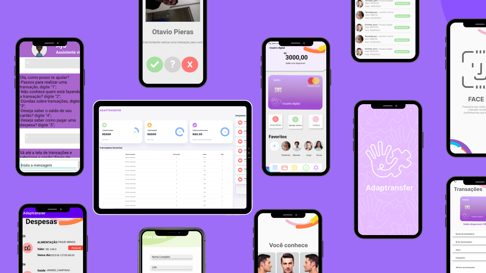

## Projeto

Trabalho de conclusão do curso técnico desenvolvido juntamente com Raissa Pinheiro, Otavio Pierin e Pedro Olivate. 
 

## Detalhes

A aplicação, que replica um sistema bancário em ambiente virtual, possui funcionalidades que permitem que o usuário realize ou receba transações de maneira segura, com validações de reconhecimento facial do remetente e confirmação de integridade por biometria. Além disso, funcionando como uma terceira ferramenta de segurança, o responsável legal pelo deficiência tem a sua disposição um dashboard que apresenta todas as atividades do usuário no aplicação, permitindo que seja feito um monitoramento e gerenciamento seguro das finanças do usuário, facilitando o processo de identificação de possíveis fraudes e golpes. Ademais toda a interface possui botões e funcionalidades intuitivas para demandar o menor esforço cognitivo do usuário. Por fim todos os dados obtidos no uso do aplicativo são armazenados em banco de dados relacional, para garantir que os processos sejam otimizados, facilitando a experiência do usuário, e para assegurar proteção e segurança.

## Preview

